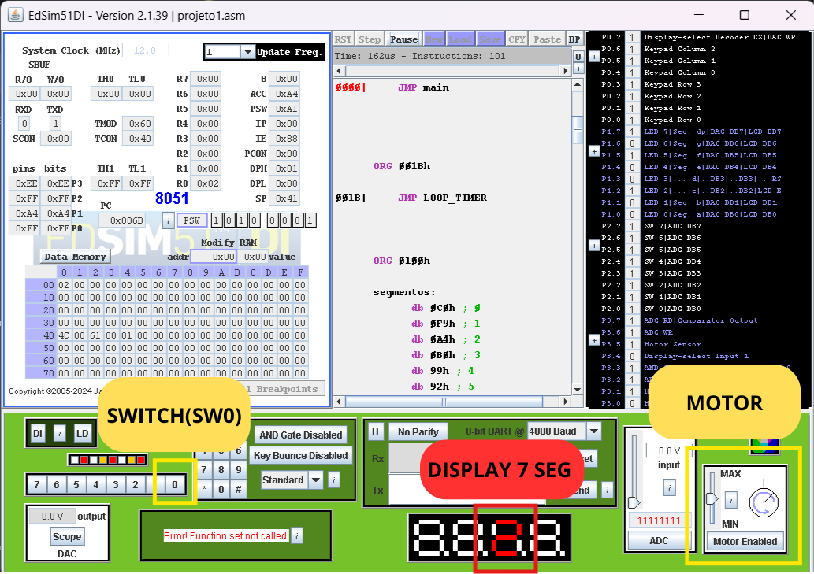
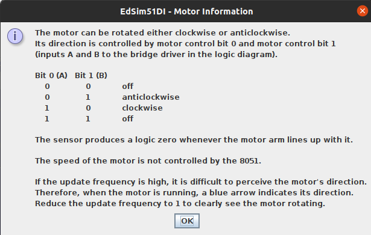

# Projeto 1 --- Entrega Final
Contador de voltas e sentido de rotação para motor de passo em Assembly (8051). Desenvolvido e validado no EdSim51.

Integrantes: 
* **Lucas Manoel Freitas da Silva (15471884)** 
* **Gabriel Suerdieck Nardelli(15453960)**

Docente:
* **Pedro de Oliveira de Conceição Junior**


# O que foi desenvolvido:

   Este programa representa a síntese dos conhecimentos adquiridos na primeira metade da disciplina de **Aplicação de Microprocessadores (EESC-USP)**. O projeto integra conceitos fundamentais de sistemas embarcados, tais como:

* **Arquitetura e Pinout:** Mapeamento físico e lógico do 8051.
* **Set de Instruções:** Uso otimizado de instruções Assembly.
* **Ciclo de Máquina e Pilha (Stack):** Gerenciamento de memória e tempo de execução.
* **I/O Digital e Periféricos:** Controle de motores, displays e sensores.

   O projeto final é a integração de três etapas fundamentais desenvolvidas ao longo do semestre:

1. **Checkpoint 1:** Leitura de botões, acionamento de LEDs e interface com display de 7 segmentos.
2. **Checkpoint 2:** Lógica de controle e inversão de direção do motor.
3. **Checkpoint 3:** Implementação do **Timer 1** para registro preciso de pulsos e contagem de voltas. 

# Funcionamento no Edsim51
## Abrindo o código
   O programa do motor rotativo com contador tem um funcionamento bem simples e compreensível. Primeiramente, para aplicarmos ele no Edsim51 vamos abrir o arquivo .asm apertando o botão de LOAD que se encontra na parte superior da tela do programa, após isso, com o código já carregado, vamos assimilar o código para podermos rodá-lo clicando em ASSM. Com o código já assimilado o próximo passo é finalmente rodá-lo clicando em RUN.
## Testando o código
   Já com o programa do motor rodando, vamos entender seu funcionamento. Antes de mais nada, certifique-se de reduzir a barra de "Update Frequency" no topo do EdSim51 para que seja possível visualizar as mudanças no display e no motor em tempo real.
   O motor, a partir do momento que o código começou a rodar, já está funcionando no sentido horário. Concomitantemente, o contador está pronto para registrar o número de voltas completas. Para simular que o motor completou uma volta e enviou um pulso ao sensor. O sistema tem um limite de 10 voltas antes de reiniciar automaticamente para 0.
   Entretanto, o diferencial desse programa é a possibilidade de mudar o sentido do motor alternando o switch SW0 (ligado ao pino P2.0), que se encontra na parte inferior esquerda do EdSim51. Quando mudamos a direção do motor, duas coisas devem acontecer: primeiramente, o ponto decimal do Display de 7 segmentos deverá acender, indicando o sentido anti-horário de rotação; além disso, o contador de voltas deverá voltar a zero instantaneamente. Perfeito, sabendo dessas informações, já é possível testar e interagir com o programa no EdSim51.


## 🔌 Mapeamento de Hardware (Pinagem)

   Para o melhor entendimento do projeto no **EdSim51**, é interessante conhecer como os periféricos são conectados, o que pode ser visualizado na tabela abaixo:

| Componente | Pino/Porta | Função |
| :--- | :--- | :--- |
| **Display 7 Segmentos** | `P1` | Saída de dados para os segmentos (Barramento) |
| **Ponto Decimal (DP)** | `P1.7` | Indicador visual de sentido: Ligado (Anti-horário) / Desligado (Horário) |
| **Chave Seletora (SW0)** | `P2.0` | Entrada de controle: Alterna o sentido de rotação e reseta o contador |
| **Motor de Passo** | `P3.0` e `P3.1` | Sinais de controle de fase para o motor |
| **Habilitação do Display** | `P3.4` | Bit de controle para ativar o display de 7 segmentos |
| **Contador de Pulsos** | `T1 (P3.5)` | Entrada do Timer 1 para contagem de pulsos externos do motor |

---
## 🧠 Lógica de Programação

   A estrutura do código foi desenvolvida de forma modular, utilizando interrupções para garantir que a contagem de voltas seja precisa e independente do fluxo principal de verificação de periféricos.

### 1. Inicialização do Hardware
   Na label `main`, configuramos os componentes fundamentais do 8051:
* **Timer 1:** Configurado no **Modo 2 (Autoreload)**. Ele atua como um contador de eventos externos (pino T1), onde cada pulso vindo do motor incrementa o registrador `TL1`.
* **Interrupções e Contagem:** A interrupção do Timer 1 é habilitada via registrador `IE` (Interrupt Enable) e a contagem é disparada pelo `TCON`. Quando o contador estoura (`FFh` -> `00h`), o programa desvia automaticamente para a rotina `LOOP_TIMER`.
* **Stack Pointer (SP):** Inicializado em `3Fh` para evitar conflitos com os bancos de registradores e a memória RAM de uso geral.

### 2. Processamento e Variáveis
   O controle do sistema baseia-se em dois elementos principais:
* **Registrador R0:** Atua como a variável de processo que armazena o número acumulado de voltas (0 a 9).
* **Flag F0:** Bit de usuário que armazena o estado do sentido de rotação. 
    * `F0 = 1`: Sentido Horário.
    * `F0 = 0`: Sentido Anti-horário.

### 3. Sub-rotinas Principais
* **`VERIFICA_CHAVE`:** Monitora o estado do pino `P2.0`. Caso detecte uma mudança na chave física em relação ao estado atual de `F0`, ela inverte o sentido de rotação nos pinos de controle e reinicia a contagem chamando a `RESET_CONTADOR`.
* **`ATUALIZA_VOLTAS`:** Converte o valor de `R0` para o formato de 7 segmentos usando a tabela no `DPTR`. Além disso, manipula o **bit 7 (ponto decimal)** do acumulador antes de enviar para o `P1`, sinalizando o sentido visualmente no display.
* **`LOOP_TIMER` (ISR):** Rotina de interrupção que incrementa `R0` a cada pulso detectado. Ao atingir 10 voltas, a sub-rotina reinicia a contagem.

### 4. Controle do Motor de Passo
   Embora o acionamento das bobinas seja gerenciado pelo hardware do Edsim51, o software controla a direção através dos pinos `P3.0` e `P3.1`. A inversão lógica desses pinos altera a sequência de pulsos enviada ao motor, resultando na inversão da rotação física.
  A tabela verdade a seguir mostra a lógica de inversão do motor:


---

### 🗺️ Fluxograma do Sistema
   Abaixo, apresentamos o fluxo lógico do programa para melhor visualização:

```mermaid
graph LR
    %% Definição de Estilos
    classDef default fill:#fff,stroke:#333,stroke-width:2px,color:#000;
    classDef decisao fill:#fff9c4,stroke:#fbc02d,stroke-width:2px,color:#000;
    classDef destaque fill:#e1f5fe,stroke:#01579b,stroke-width:2px,color:#000;

    A[Evento Externo/Pulso]:::destaque --> B{Timer 1<br/>Contador}:::decisao
    B -->|Incremento| C[Registrador R0<br/>Voltas]
    C --> D[Tabela de Segmentos]
    D --> E[Display P1]:::destaque
    
    F[Chave P2.0]:::destaque -->|Inverte| G[Flag F0<br/>Sentido]:::decisao
    G -->|Ponto Decimal| E
    G -->|Sinais de Controle| H[Motor de Passo]:::destaque
